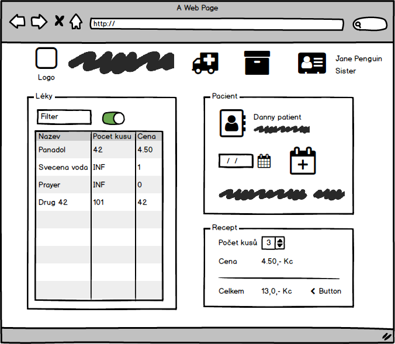

# Wireframes

## Zadání

Vaším úkolem je vytvořit wireframy pro váš projekt. 
* Vaším úkolem je vytvořit minimálně 6 wireframů které budou pokrývat obě platformy pro které budete implementovat UI. 
* Mimo wireframe připravte mapu navigace v aplikaci. (Navigaci můžete zakomponovat do wireframu nebo zakreslit samostatně).

### Wireframe example

### Sitenav example

## Nástroje
Existujé různé nástroje pro tvorbu wireframů, vyberte si cokoliv co vám bude vyhovovat. Zde je pár návrhů.

* https://app.diagrams.net/
* https://balsamiq.com/
* https://www.lucidchart.com/

